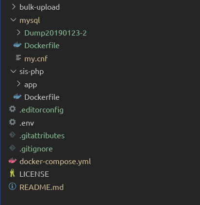

## sis-deployment
This a comple packge for sis dev environment. To get use of this setup you need the following dependacny installed in you computer

This package have three componants

1. SIS applications -   (https://github.com/moe-lk/sis-php.git) 
2. SIS bulk upload application - (https://github.com/moe-lk/bulk-upload.git)
3. Mysql - store this files to mysql (https://github.com/moe-lk/sis/tree/master/mysql/Dump20190205)

Your folder structure should be like below

Dependancies 
1. Docker
2. Docker Compose

To contribute to this project 
To run the application do run `docker-composer build && docker-compose up`
